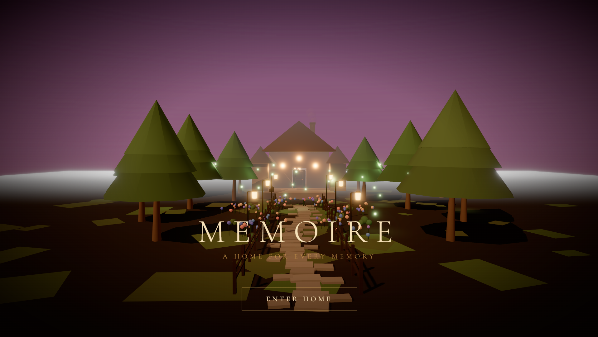
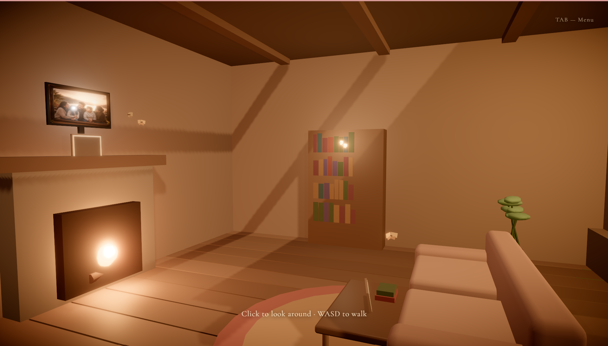
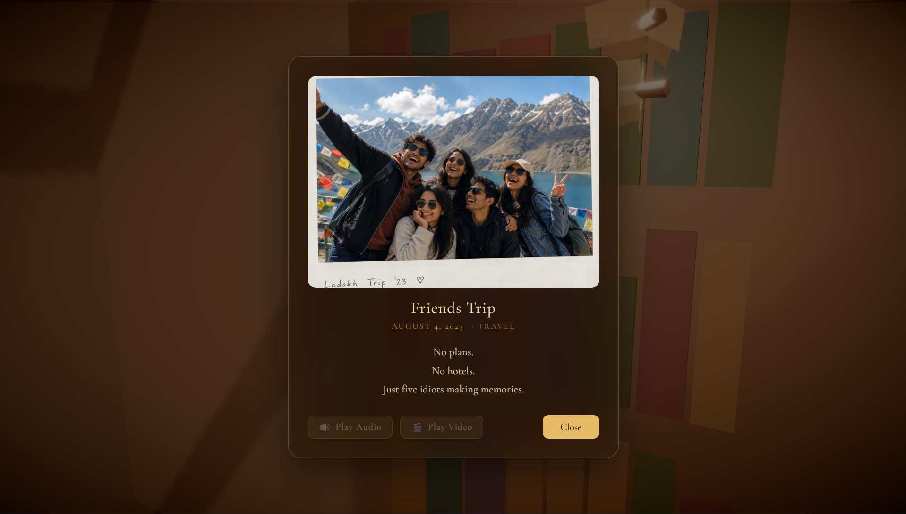
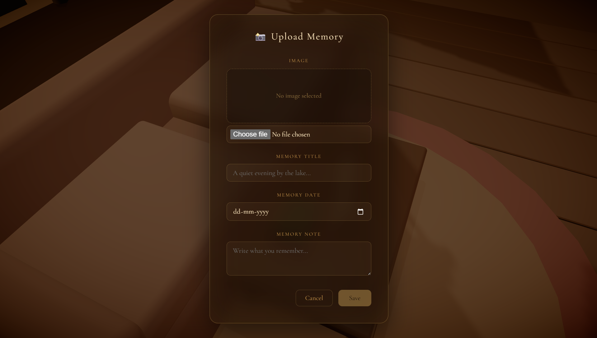

# 🏡 Memoire

<h3 align="center"><i>A Home Where Every Memory Lives Forever.</i></h3>

Transform your cherished memories into an immersive 3D experience.

---

## 🌐 Live Demo

🔗 **Vercel:** https://memoire-home.vercel.app

## 📂 GitHub Repository

🔗 https://github.com/Jay-81/Memoire

---

# ✨ Overview

Most memory applications reduce our life's most meaningful moments into folders, thumbnails, and endless scrolling.

**Memoire** reimagines the way we revisit memories.

Instead of browsing a gallery, users step inside a beautifully designed virtual home where every cherished memory becomes a meaningful object placed naturally throughout the environment.

Walk through cozy rooms.
Discover memories.
Relive moments.

Every photograph, video, audio recording, and handwritten note becomes part of a living space rather than just another file.

The experience combines emotional storytelling with immersive UI design to create a completely new way of interacting with personal memories.

---

# 💡 The Problem

Traditional gallery applications organize memories like files.

While efficient, they lack emotional connection.

People don't remember life through folders—they remember places, objects, and experiences.

Scrolling through thousands of images often feels disconnected from the memories themselves.

There is little sense of exploration, nostalgia, or storytelling.

---

# 💙 Our Solution

Memoire transforms digital memories into a spatial experience.

Instead of browsing folders, users physically explore a virtual home where memories naturally belong.

Each memory is represented as an object inside the house:

🏡 Family photographs rest above the fireplace.

🎓 Graduation memories proudly decorate the bookshelf.

🌄 Travel adventures sit casually on the coffee table.

🦋 Gentle butterflies guide users toward discoverable memories, encouraging exploration rather than search.

The result is a more emotional and engaging way of revisiting life's important moments.

---

# 🚀 Features

### 🏡 Immersive 3D Cottage

A fully interactive cozy home built using React Three Fiber.

---

### 🚶 First Person Exploration

Move naturally through the house using WASD controls.

---

### 🚪 Interactive Entrance

Walk to the entrance and press **E** to open the front door.

---

### 🦋 Butterfly Guided Discovery

Instead of intrusive indicators, subtle butterflies gently hover near memories, encouraging curiosity and exploration.

---

### 🖼 Physical Memory Frames

Memories are placed naturally throughout the home instead of existing inside menus.

---

### 📺 Living Room Memory TV

An interactive television designed to showcase memories in a modern way.

---

### 📤 Upload Personal Memories

Users can upload their own:

- 📷 Photos
- 🎥 Videos
- 🎵 Audio
- 📝 Personal Notes

without leaving the experience.

---

### 💬 Memory Viewer

Open memories with a beautiful popup containing:

- Image
- Title
- Date
- Personal Note
- Audio Placeholder
- Video Placeholder

---

### ✨ Cozy Atmosphere

The environment includes

- Warm lighting
- Fireflies
- Butterflies
- Indoor plants
- Wooden furniture
- Soft evening ambience

to create a relaxing nostalgic experience.

---

### ⚡ Optimized Performance

Startup performance has been optimized by lazy-loading heavy demo assets while preserving the visual experience.

---

# 🎮 Controls

| Key | Action |
|------|---------|
| W | Move Forward |
| A | Move Left |
| S | Move Backward |
| D | Move Right |
| Mouse | Look Around |
| E | Open Door |
| F | View Memory |
| ESC | Exit Mouse Capture |

---

# 🛠 Tech Stack

### Frontend

- React
- Vite
- JavaScript
- CSS

### 3D

- Three.js
- React Three Fiber
- Drei

### Deployment

- GitHub
- Vercel

---

# 🧠 Design Philosophy

Memoire was designed around one simple idea:

> **"Memories deserve places, not folders."**

Every interaction encourages slow exploration.

Instead of clicking through interfaces, users wander through a familiar environment where memories reveal themselves naturally.

The interface almost disappears, allowing emotions to become the primary focus.

---

# 📸 Screenshots

## Home Exterior

---

## Living Room

---

## Memory Interaction

---

## Upload Memory

---

# 🔮 Future Scope

Future versions of Memoire could include:

- 🤖 AI-generated memory stories
- 🎤 Voice narration for memories
- ☁ Cloud synchronization
- 👨‍👩‍👧 Shared family homes
- 🥽 VR compatibility
- 📅 Timeline-based memory exploration
- 🧠 AI-powered memory recommendations
- 📍 Location-aware memories
- 🌎 Multiplayer family spaces

---

# 🌍 Real World Applications

Memoire can be adapted for:

- Personal Memory Journals
- Digital Scrapbooks
- Family Heritage Preservation
- Elderly Memory Therapy
- Interactive Museums
- Memorial Experiences
- Digital Time Capsules
- Educational Storytelling

---

# 👨‍💻 Developed For

### Build The Next Big UI – 2026

Frontend-focused Hackathon

Built to demonstrate how immersive interfaces can transform emotional digital experiences.

---

# ❤️ Acknowledgements

Built with ❤️ using

- React
- Three.js
- React Three Fiber
- Vite

Special thanks to the open-source community for making immersive web experiences possible.

---

# ⭐ If you enjoyed this project

Give this repository a ⭐

Every memory deserves a home.
